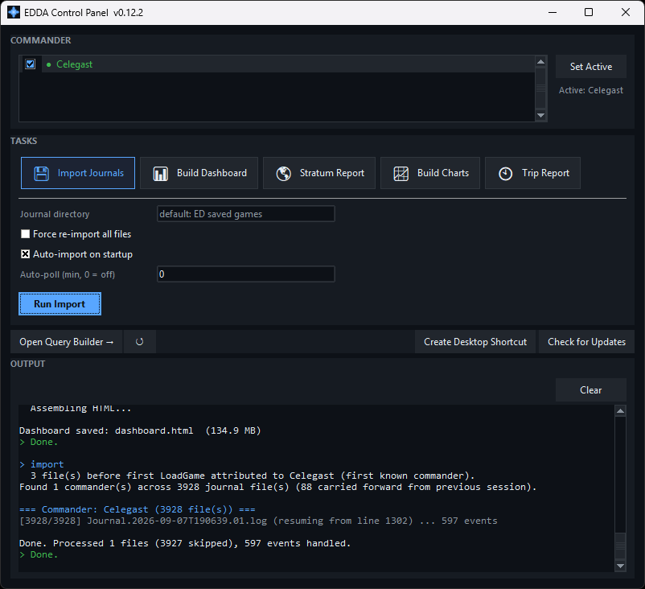
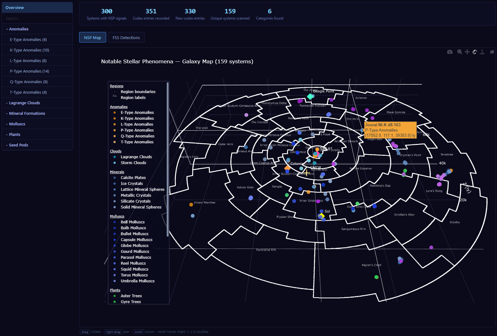
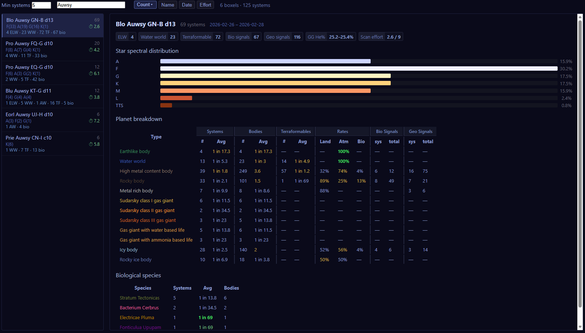
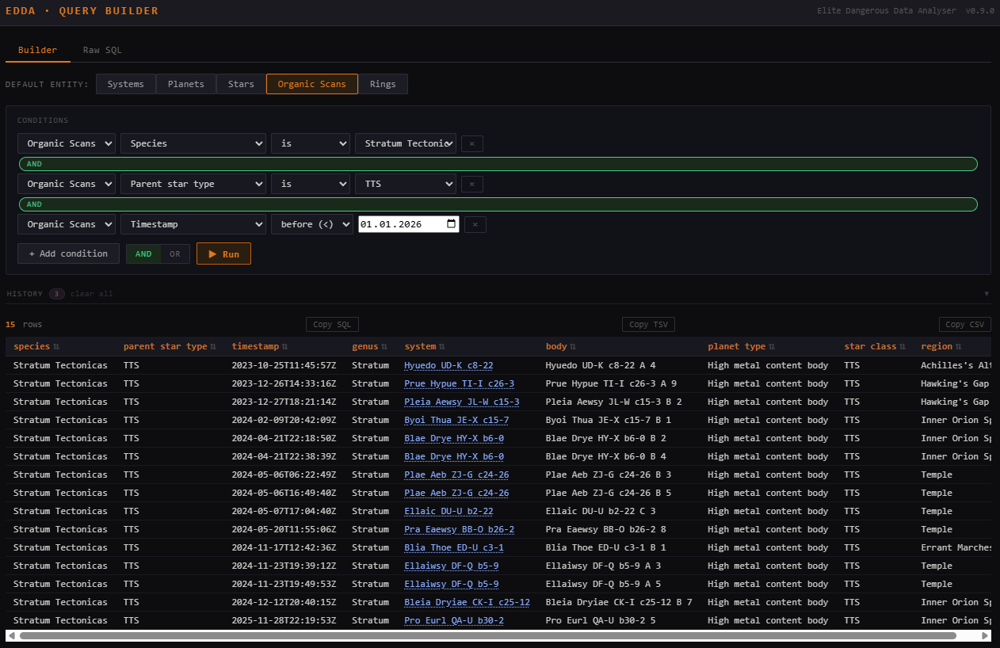

# EDDA — Elite Dangerous Data Analyser

Turns your Elite Dangerous journal files into a local database and a self-contained
HTML dashboard: exploration stats, galaxy maps, exobiology analysis, boxel
analytics, trip reports, and a visual query builder. Everything runs locally — no
account, no uploads.


## Install

1. Install **Python 3.12+** ([python.org](https://www.python.org/downloads/) — on Windows tick *"Add Python to PATH"*).
2. Run the setup script (installs PDM + dependencies into a local venv):

   | Windows | Linux / macOS |
   |---|---|
   | `setup.bat` | `chmod +x setup.sh && ./setup.sh` |

## Run

**Desktop app** — double-click **`EDDA.bat`** (Windows) / **`EDDA.sh`** (Linux/macOS).
A control panel to import journals, pick which commander(s) to report on, and build
the dashboard / trip report / research reports, with a live log and one-click
"open when done".



**Terminal** — everything the app does is also a command:

```bash
pdm run import        # parse all journal files into the database
pdm run dashboard     # build dashboard.html
pdm run stats         # print a lifetime summary
```

Open `dashboard.html` in any browser. Import is incremental and idempotent — re-run
it any time; it resumes partially-written files and skips finished ones.

**Multiple commanders:** `pdm run import` (no `--db`) auto-detects each commander in
your journals and keeps a separate `.edda/<name>.db`. The desktop app lets you tick
one or more; reports merge the selected databases.

## What you get

**Dashboard** (`pdm run dashboard`) — one self-contained HTML file, tabbed sidebar:

- **Overview** — lifetime counts, and *Vicinity Hints*: helium-rich / Stratum
  Tectonicas / high-value boxels within 5,000 ly of your last position.
- **Personal Records** — top-10 systems (bodies, stars, bio signals, exo & explo
  value) and personal bests; a desktop-app popup tells you when a build beats one.
- **Galaxy & Sector Maps** — interactive 3D (true galaxy scale, toggleable region
  overlay) plus static PNGs; a sector cube heat map with switchable layers
  (density / terraformable / ELW / bio rate).

  

- **Bodies / Species / Star-class catalogues** — per-type stats, property ranges
  with clickable body names, estimated scan values, and a per-dominant-star
  spectral-distribution chart for each species and body type.

  

  
- **Exobiology** — species log by genus, value breakdowns, genus × planet-type
  heatmap, 3D species maps, and a He% vs Stratum Tectonicas probability chart.

  
- **Notable Stellar Phenomena** — every NSP codex type on a colour-coded 3D map,
  an FSS-detections table, and per-type drill-downs with new-in-region tracking.

  
- **Boxels** — filterable list of every boxel you've visited, sortable by count /
  name / date / **scan effort** (0–9 estimate of how tedious the systems are to
  fully scan). Per-boxel detail: star mix, planet breakdown, bio species, He%
  range.



**System map** — click any system name anywhere (dashboard, tables, query results,
trip report) for an interactive body-hierarchy diagram: scaled icons, rings,
first-discovery badges, bio rings (bright = sampled, dim = signal only), rich
tooltips, and a galaxy minimap.


**Trip report** (`pdm run trip -- --from … --to … --html trip.html`) — a
self-contained report for a date range: estimated & sold value, daily-earnings and
Cr/active-hour charts, sortable systems/species/planet tables, an interactive 3D
route map, and Powerplay merit/CP estimates (Antal & Li Yong-Rui bonuses applied
automatically from your merit history).

**Stratum Tectonicas research report** (`pdm run stratum`) — a collaborative
field-research report over all 1-bio thin-atmosphere HMC bodies: classification,
property distributions, correlation matrices, parent-star context. Auto-exports a
per-commander JSONL; `--from-files "*.jsonl"` builds a combined multi-commander
report with no database.

**Query Builder** (`pdm run serve`, or `serve.bat` / `serve.sh`) — a local browser
UI to query the database with dropdown conditions or raw SQL, with mixed AND/OR
logic, a re-runnable history, CSV/TSV export, and clickable system links.



## Command reference

| Command | Purpose | Key flags |
|---|---|---|
| `pdm run import` | Parse journals into the DB | `--force` (reprocess all), `--journal-dir DIR`, `--quiet` |
| `pdm run dashboard` | Build `dashboard.html` | `--out FILE` |
| `pdm run trip` | Trip stats / HTML report | `--from` `--to` (required), `--html PATH`, `--systems` |
| `pdm run stratum` | Stratum research report | `--min-temp`/`--max-temp K`, `--export FILE`, `--from-files GLOB` |
| `pdm run map` | Galaxy & sector maps → `output/` | `--static-only`, `--interactive-only` |
| `pdm run charts` | Analytics charts → `output/` | `--static-only`, `--interactive-only` |
| `pdm run stats` | Lifetime summary to terminal | — |
| `pdm run serve` | Query Builder web UI | `--port PORT` |

All commands take `--db PATH` to point at a specific database. Dates accept
`YYYY-MM-DD` or `YYYY-MM-DDTHH:MM`.

`pdm` must be on your PATH for `pdm run …` (the setup/update scripts and the
desktop app fall back to `python -m pdm` automatically). Typical PATH addition:
`%APPDATA%\Python\PythonXXX\Scripts` (Windows) or `~/.local/bin` (Linux/macOS).

## Updating

`update.bat` / `./update.sh` — pulls the latest code, syncs dependencies, and
rebuilds everything. (If `git` isn't available the pull is skipped and the rest
still runs.) The desktop app also checks for updates on launch.

## How it works

- **Database:** SQLite under `.edda/` (one file per commander, created on first
  import). Tables cover systems, jumps, bodies, rings, materials, bio/organic
  scans, sales, codex entries, FSS signals, missions, Powerplay merits, and
  commander/statistics snapshots. Journal events not handled *and* not on the
  known-ignore list trigger a warning at the end of import.
- **Boxel:** the system-name prefix without the trailing index — `Prooe Drye ZQ-K
  d9` for `Prooe Drye ZQ-K d9-N`. Systems in a boxel share stellar-forge
  properties, so per-boxel aggregates are meaningful.
- **Credit values:** community-verified Odyssey formula —
  `k_total × (1 + 0.566 × mass_em^0.19998) × discovery × mapping`, with the
  terraform bonus always applied to Earthlikes. Exobiology uses the Vista Genomics
  price table with optional first-log (×5) and Antal bonuses.
- **Parent-star attribution:** a body's dominant star is the first `Star` in its
  journal `Parents` chain, so bodies orbiting a companion are attributed to that
  companion — occasionally surprising, but it reflects the real stellar
  environment.

## Project layout

```
src/edda/
├── cli.py                  pdm run entry points
├── gui.py                  desktop control panel (EDDA.bat)
├── serve.py                Flask Query Builder (pdm run serve)
├── db/                     schema + connection helpers
├── importer/               journal discovery + per-event handlers
└── analysis/
    ├── valuation.py        credit-value formula
    ├── stats.py            SQL queries / DataFrame transforms
    ├── charts.py  maps.py  matplotlib + Plotly figures
    ├── dashboard.py        HTML dashboard assembler
    ├── trip_report.py      HTML trip report
    └── stratum_report.py   Stratum research report
```

## Acknowledgements

- [klightspeed/EliteDangerousRegionMap](https://github.com/klightspeed/EliteDangerousRegionMap) — galactic region data for the map overlays
- **CMDR SigmaExplorer** / [IGAU](https://github.com/Intergalactic-Astronomical-Union/publications) — the "Boxel Helium vs Stratum Tectonicas" research this tool's He% analysis builds on
- [Canonn Research](https://canonn.science/) and the [ED community wiki](https://elite-dangerous.fandom.com/wiki/Elite_Dangerous_Wiki)
- **CMDR Vithigar** & **CMDR MattG** — [Elite Observatory](https://github.com/Xjph/ObservatoryCore), which inspired many of EDDA's analytics
- Beta testing: **[CMDR BacardEsan](https://www.twitch.tv/bacardesan)**
