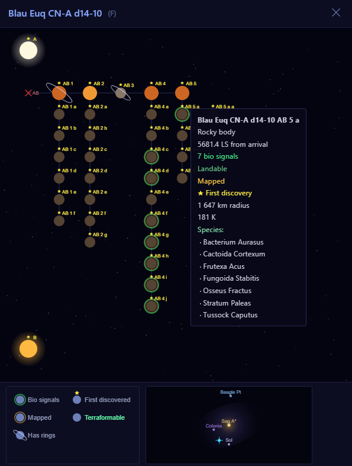
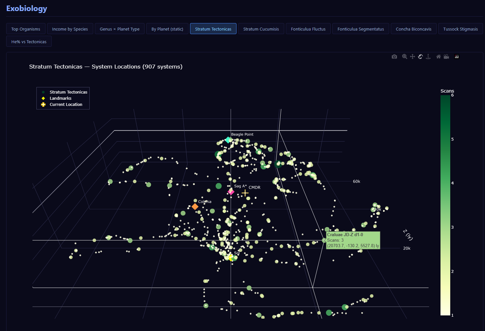
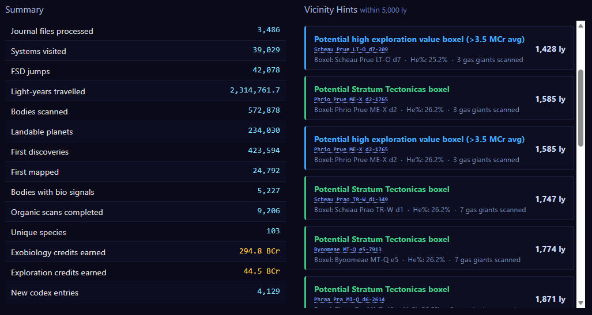
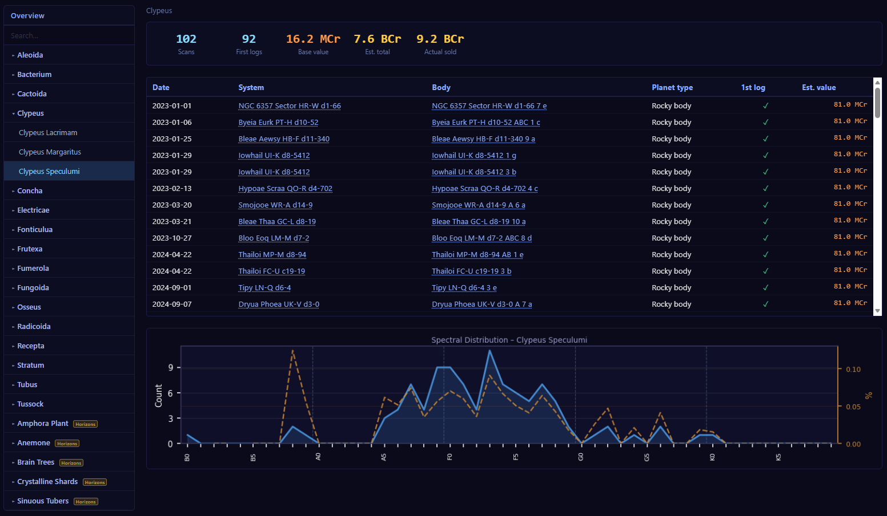
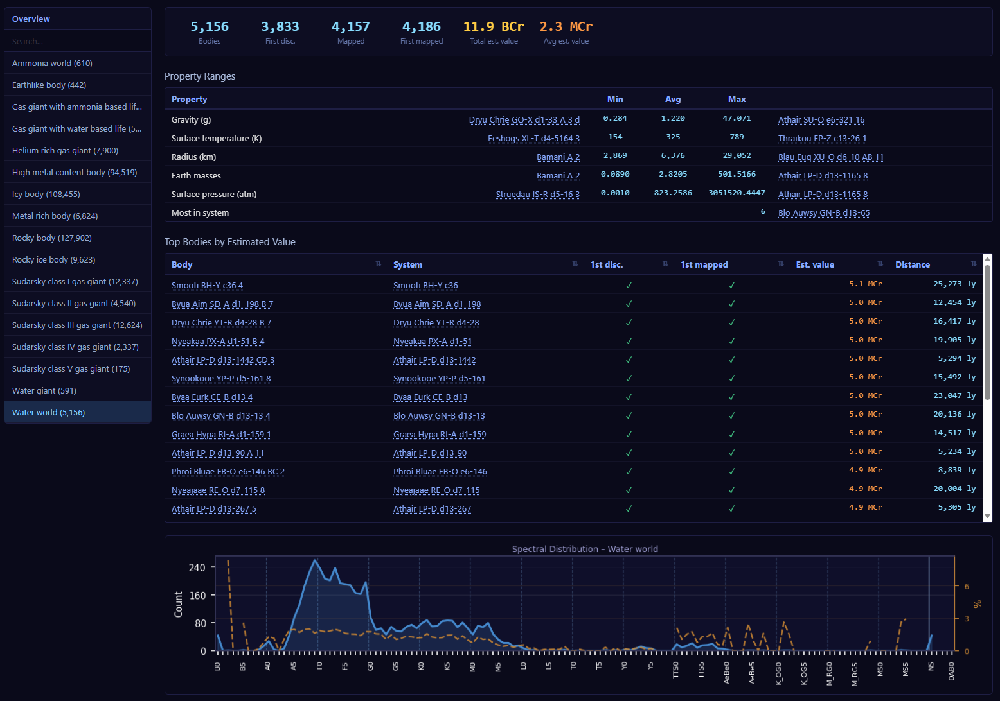
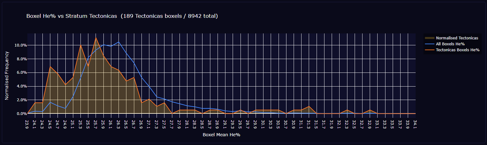

# EDDA — Elite Dangerous Data Analyser

A personal exploration analytics tool for Elite Dangerous. Parses your journal files into a local SQLite database and produces statistics, charts, galaxy maps, and a self-contained HTML dashboard.

## Screenshots

**System Maps**



**Interactive 3D Maps**



**Overview & Vicinity Hints**



**Species Catalogue**



**Body-type Catalogue**



**Exobiology Analysis**




## Features

- **Journal importer** — incrementally processes Elite Dangerous journal files; resumes partially-imported files (e.g. when the game was open during import) without duplicating data; idempotent re-runs skip already-imported files
- **Exploration statistics** — system counts, jump distance, first discoveries, mapping stats
- **Trip report** — scoped statistics for a date range, useful for comparing expedition results against tools like Elite Observatory
- **Galaxy maps** — interactive 3D Plotly maps oriented with Sol in front and Colonia to the left, scaled to true in-game galaxy dimensions; static PNG variants for density, bio signals, and first discoveries
- **Sector heat maps** — 1200 ly cube grid coloured by system density, with an interactive 3D version
- **Valuable regions** — rate-normalised sector maps showing ELW, Water World, terraformable, and bio-signal density per visited system; galactic-height (Y) correlation charts; star-class correlation charts
- **Exobiology charts** — species distribution, value breakdown by planet type, 3D species bubble maps, and a He% vs Stratum Tectonicas probability chart (mirrors the community "Boxel Helium vs Tectonicas" chart)
- **Boxel analytics** — He% vs average system exploration value chart; identifies He% ranges associated with high-value boxels (>3.5 MCr average)
- **Body value catalogue** — per-body estimated exploration credit value using the Odyssey formula, with correct terraforming bonus handling for Earthlike bodies and Water Worlds; property ranges (min/avg/max with body names) and most-of-type-in-system records per planet type
- **Star-class catalogue** — per-star-class system and body statistics grouped by star type (main sequence, giants and supergiants, proto-stars, carbon stars, Wolf-Rayet, white dwarfs, neutron stars, black holes); property ranges (surface temperature, solar radius, solar mass, age) with min/avg/max and body names; most-of-class-in-system records
- **Species catalogue** — species grouped by genus with per-genus overview panels and per-species drill-down; first-log tracking; scan counts, estimated and actual sale values; planet-type breakdown per species
- **Spectral distribution charts** — per-species and per-body-type line charts showing how scan counts and occurrence percentages are distributed across the detailed spectral subclass of the dominant star (G2, F5, K3, …); useful for cross-referencing community data such as the He% vs Stratum Tectonicas chart
- **System map** — interactive canvas-based system diagram, opened by clicking any system name in the dashboard; shows all bodies in their hierarchical tree layout with scaled icons, ring indicators, first-discovered badges, terraformable highlights, rich tooltips (surface properties, bio species, ring details), a two-column icon legend, and a galaxy minimap showing the system's position relative to Sol, Colonia, and Beagle Point
- **Clickable system links** — system and body name references throughout the dashboard (Personal Records, Property Ranges tables, Vicinity Hints) open the system map modal on click
- **Personal Records** — top-10 lists for most bodies, most stars, most bio signals, top exobiology value, and top exploration value per system; all tables show distance to current commander position; Miscellaneous personal bests (highest/lowest gravity, hottest/coldest surface, largest/smallest radius, longest jump)
- **Vicinity Hints** — automatically surfaces interesting boxels within 5,000 ly of the commander's current position:
  - *Potential helium-rich boxel* — mean He% above 28.5% with ≥3 gas giants
  - *Potential Stratum Tectonicas boxel* — He% in community-identified sweet spots (24.2–24.5% or 25.9–26.5%)
  - *Potential high exploration value boxel* — He% in ranges correlated with >3.5 MCr average system value (24.7–25.4%, 26.2–26.4%, 30.05–30.15%)
- **Income charts** — exploration and exobiology credits earned over time (cumulative)
- **Dashboard** — all of the above assembled into a single self-contained HTML file with a tabbed navigation sidebar, showing the current package version

## Requirements

- Python 3.12 or newer
- Elite Dangerous installed (journal files must be accessible)

> **PDM and PATH**: the setup and update scripts fall back to `python -m pdm` automatically if `pdm` is not on your PATH. The `pdm run …` commands listed in this README however require `pdm` to be reachable directly. On Windows the typical location to add is `%APPDATA%\Python\PythonXXX\Scripts`; on Linux/macOS it is usually `~/.local/bin`.

## Installation

**Windows (double-click or run in any terminal):**
```bat
setup.bat
```

**Windows (PowerShell — requires execution policy to be set):**
```powershell
.\setup.ps1
```
> If you see a script execution error, run it without changing execution policy:
> `powershell.exe -ExecutionPolicy Bypass -File .\setup.ps1`

**Linux / macOS:**
```bash
chmod +x setup.sh
./setup.sh
```

This runs `pdm install`, which creates a virtual environment and installs all dependencies.

## Updating

Run this once to pull the latest code, sync dependencies, re-import journals, and rebuild everything:

**Windows (double-click or run in any terminal):**
```bat
update.bat
```

**Windows (PowerShell — requires execution policy to be set):**
```powershell
.\update.ps1
```
> If you see a script execution error, run it without changing execution policy:
> `powershell.exe -ExecutionPolicy Bypass -File .\update.ps1`

**Linux / macOS:**
```bash
./update.sh
```

If `git` is not installed (e.g. you downloaded a ZIP from the repository), the pull step is skipped automatically — update the files manually and the rest of the script still runs.

Then open `dashboard.html` in a browser.

## Updating dependencies

Dependencies are pinned in `pdm.lock` (committed to the repository). To intentionally bump to newer versions within the declared bounds:

```bash
pdm update
```

Then commit the updated `pdm.lock`. Everyone else gets the new versions on the next `git pull` + `pdm sync`.

## Running commands manually

All commands are run through PDM:

```bash
pdm run import       # import journal files
pdm run stats        # print summary to terminal
pdm run dashboard    # build dashboard.html
```

Pass arguments after `--`:

```bash
pdm run trip -- --from 2025-01-01 --to 2025-03-31
pdm run import -- --force --quiet
```

## Quick start

```bash
pdm run import       # parse all journal files into the database
pdm run stats        # print a lifetime summary to the terminal
pdm run dashboard    # build dashboard.html
```

Open `dashboard.html` in any browser — no server required.

## Browser compatibility

The dashboard is a fully self-contained HTML file (no server, no external requests). It works in all modern browsers on all platforms:

| Browser | Notes |
|---|---|
| Chrome / Chromium | Full support, recommended |
| Firefox | Full support |
| Edge | Full support |
| Safari | Full support |

The interactive 3D galaxy maps use WebGL via Plotly.js. This is supported by all modern browsers. On Linux without a dedicated GPU, software rendering (Mesa/llvmpipe) works but may be slower on older hardware.

The dashboard file is several MB in size due to embedded Plotly.js and base64-encoded chart images. It loads from the local filesystem (`file://`) without any issues.

## Commands

### `pdm run import`

Parses journal files and writes data into `.edda/ed.db`.

```
pdm run import -- [--journal-dir DIR] [--db PATH] [--force] [--quiet]
```

| Flag | Description |
|---|---|
| `--journal-dir DIR` | Override the journal directory (default: standard ED path for the OS) |
| `--db PATH` | Use a different database file |
| `--force` | Re-process files that were already imported |
| `--quiet` | Suppress per-file progress output |

Handled journal events:

| Event | Stored in |
|---|---|
| `FSDJump` | `systems`, `jumps` |
| `Location` | `systems` |
| `Scan` | `bodies`, `systems` |
| `DiscoveryScan` | `systems.total_bodies` |
| `FSSBodySignals` | `bio_signals` |
| `FSSAllBodiesFound` | `systems.fss_complete` |
| `FSSSignalDiscovered` | `fss_signals` |
| `SAASignalsFound` | `bio_signals` |
| `SAAScanComplete` | `bodies.was_mapped` |
| `ScanBaryCentre` | `barycentres` |
| `ScanOrganic` | `organic_scans` |
| `SellOrganicData` | `organic_sales` |
| `CodexEntry` | `codex_entries` |
| `SellExplorationData` | `exploration_sales` |
| `MultiSellExplorationData` | `exploration_sales` |
| `MissionCompleted` | `missions` |
| `PowerplayMerits` | `powerplay_merits` |
| `Statistics` | `statistics_snapshots` |
| `Rank` | `commander_snapshots` |
| `Promotion` | `commander_snapshots` |
| `LoadGame` | `commander_snapshots` |

All other event types are silently ignored. If a journal file contains an event type not in the handled list and not in the known-ignored list, a warning is printed at the end of the import — this indicates a new game event that may be worth handling.

### `pdm run stats`

Prints a lifetime summary to the terminal, including personal records (highest gravity, hottest surface, longest jump, etc.).

```
pdm run stats -- [--db PATH]
```

### `pdm run trip`

Prints statistics scoped to a date range — useful for expedition reports.

```
pdm run trip -- --from YYYY-MM-DD --to YYYY-MM-DD [--systems] [--db PATH]
```

Outputs:
- Jump and system counts, light-years travelled
- Exobiology samples with base / first-log / Antal-bonus value estimates
- Planet-type breakdown with first-discovery and first-mapped counts
- Estimated exploration credit value for the period
- Personal bests within the range
- `--systems`: full chronological list of every system visited

### `pdm run map`

Renders galaxy maps and sector heat maps.

```
pdm run map -- [--out DIR] [--static-only] [--interactive-only] [--db PATH]
```

Outputs (in `output/` by default):

| File | Description |
|---|---|
| `galaxy_density.png` | Top-down dot map coloured by visit density |
| `galaxy_bio.png` | Top-down map coloured by bio-signal count |
| `galaxy_first_discoveries.png` | Top-down map coloured by first discovery flag |
| `galaxy_side.png` | Side-view (X / Y) scatter |
| `galaxy_interactive.html` | Interactive 3D Plotly map |
| `galaxy_bio_interactive.html` | Interactive bio-signal 3D map |
| `sector_heatmap.png` | Sector grid heat map (PNG) |
| `sector_heatmap.html` | Interactive 3D sector cube map |

All 3D maps use fixed in-game galaxy axis ranges (X: ±50,000 ly, Y: −16,000 / +9,000 ly, Z: −24,000 / +76,000 ly) so sparse data does not distort the proportions.

### `pdm run charts`

Renders all analytics charts.

```
pdm run charts -- [--out DIR] [--static-only] [--interactive-only] [--db PATH]
```

Outputs include body type counts, star class counts, exploration and exobiology income over time, jump distance histogram, top species, species × planet type heat map, body value breakdowns, the valuable-regions charts (`body_rate_vs_z`, `body_rate_vs_star_class`, `sector_terra_rate`, `sector_elw_rate`), and the He% correlation charts.

### `pdm run dashboard`

Builds a single self-contained HTML file with all analytics.

```
pdm run dashboard -- [--out FILE] [--db PATH]
```

The dashboard sections:

| Section | Contents |
|---|---|
| Overview | Key lifetime counts and Vicinity Hints (helium-rich, Tectonicas, and high-value boxels within 5,000 ly); system names are clickable links |
| Personal Records | Top-10 tables for most bodies, most stars, most bio signals, top exobiology value, top exploration value; Miscellaneous personal bests (gravity, temperature, radius, longest jump); body and system names are clickable links |
| Galaxy Maps | Interactive 3D views (all systems, bio signals, first discoveries) and static PNG maps |
| Sector Map | Interactive 3D sector cube density map |
| Valuable Regions | Rate-normalised sector maps; body rates vs galactic height and star class; top sectors table |
| Bodies | Planet-type and star-class charts (star classes shown in spectral colours with abbreviated labels); body value breakdown; He% vs average system value line chart |
| Exobiology | Species scan log grouped by genus, value breakdown by species and planet type, interactive genus × planet-type heatmap with row/column totals, 3D species bubble maps, He% vs Stratum Tectonicas probability chart |
| Income & Travel | Cumulative exploration and exobiology credits; jump distance histogram |
| Species Catalogue | Per-genus overview panels with per-species drill-down; scan counts, first-log tracking, estimated and actual sale values; planet-type breakdown; spectral distribution chart per species and per genus |
| Body-type Catalogue | Per-type totals with first-discovery and mapping stats; property ranges (gravity, temperature, radius, Earth masses, surface pressure) with min/avg/max and body names (clickable); most bodies of that type in one system (clickable); sortable detail table with distance to commander; spectral distribution chart per body type |
| Star-class Catalogue | Stars grouped by type; per-class system and body statistics; property ranges (surface temperature, solar radius, solar mass, age) with min/avg/max and star names; most stars of that class in one system; sortable detail table with distance to commander |

## System Map

Clicking any system name in the dashboard opens a modal with an interactive system diagram rendered on an HTML5 canvas. The diagram shows all scanned bodies arranged in a hierarchical tree:

- **Stars** are sized by type — supergiants largest, main-sequence mid-size, neutron stars and black holes smallest
- **Planets** are sized by class — gas giants larger than rocky/icy worlds
- **Rings** are drawn as a tilted ellipse arc passing behind and in front of the body icon (asteroid belts are excluded)
- **Gold star badge** (★) above the icon marks bodies that were first discovered by the commander
- **Green labels** highlight terraformable bodies; yellow labels are used otherwise
- **Tooltips** appear on hover and include: body type, subtype, distance, temperature, gravity, atmosphere, bio signal count with species names, and ring details
- **Legend** at the bottom explains all icon decorations
- **Galaxy minimap** alongside the legend shows the system's position in the galaxy with Sol, Colonia, and Beagle Point as reference points

## Vicinity Hints

The Overview section surfaces up to 10 hints per category, distance-sorted, within 5,000 ly of the commander's last known position. Hints require He% data in the database — populated from `AtmosphereComposition` in `Scan` journal events. Three hint types are shown:

| Colour | Type | Condition |
|---|---|---|
| Orange | Helium-rich boxel | Mean boxel He% > 28.5%, ≥3 gas giants scanned |
| Green | Stratum Tectonicas boxel | He% in 24.2–24.5% or 25.9–26.5% (community chart: probability > 5%) |
| Blue | High exploration value boxel | He% in 24.7–25.4%, 26.2–26.4%, or 30.05–30.15% (avg system value > 3.5 MCr) |

When actual He% data is not yet available (e.g. before a full reimport), Helium Rich Gas Giants are used as a proxy (He% assumed 35%).

A *boxel* is the system-name prefix after stripping the trailing index number — e.g. `Prooe Drye ZQ-K d9` for systems named `Prooe Drye ZQ-K d9-N`. All systems in a boxel share the same stellar forge properties.

## Spectral Distribution Charts

Each species and body-type panel in the Species Catalogue and Body-type Catalogue includes a spectral distribution chart showing:

- **Blue line / fill (left axis)** — absolute scan count per spectral subclass of the dominant star (O0–O9, B0–B9, …, Y0–Y9, TTS, AeBe, giants, S/MS, and aggregated groups for C★, W-R, WD, NS, BH)
- **Orange dashed line (right axis)** — occurrence percentage: what fraction of all scanned planets orbiting that spectral subclass contain this species or body type

The x-axis covers every subclass 0–9 for each stellar class that appears in the data, so spacing is always uniform within a class. Rare compact types (white dwarfs, neutron stars, black holes, Wolf-Rayet, carbon stars) are aggregated into single labelled points separated by gaps for readability.

### Parent-star attribution

A body's dominant star is determined from the `Parents` array in the journal `Scan` event, which lists the body hierarchy from the body outward to the system barycentre. EDDA walks this chain and takes the first `Star` entry as the body's direct parent star. This is stored as `parent_star_id` in the `bodies` table.

For bodies where no parent star is recorded (e.g. the primary star itself), the system's primary star (lowest body ID matching the system's star class) is used as a fallback.

**Multi-star systems**: in systems with companion stars, a body that physically orbits a secondary or tertiary star will be attributed to that companion, not to the system primary. For example, Stratum Tectonicas found in a system whose primary is an F star but whose secondary is a G star will appear under G in the chart if the body orbits the G companion directly. This correctly reflects the stellar environment experienced by the organism, but means the charts can show species under star classes that the community considers unexpected — worth cross-checking in-game when a surprising attribution is found.

## Database

The SQLite database lives at `.edda/ed.db` (created automatically on first import). Key tables:

| Table | Contents |
|---|---|
| `systems` | Every visited star system with galactic coordinates, primary star class, total body count, and FSS-complete flag |
| `jumps` | Every FSD jump in chronological order with distance and fuel data |
| `bodies` | All scanned bodies with physical properties; stars include `subclass`, `luminosity`, `absolute_magnitude`; planets include orbital elements, rotation, axial tilt, rock/ice/metal composition, and `reserve_level` for ringed bodies |
| `body_materials` | Surface material percentages per body (from the `Materials` array in `Scan` events) |
| `rings` | Ring data per body (name, class, mass, inner/outer radius) from the `Rings` array in `Scan` events; asteroid belts are stored here but excluded from ring-icon rendering |
| `bio_signals` | Biological signal genus entries per body from DSS probing |
| `organic_scans` | Individual organism scan events (Log / Sample / Analyse states) |
| `organic_sales` | Vista Genomics sale records with first-log bonus tracking |
| `exploration_sales` | Cartography data sale records |
| `codex_entries` | Codex discoveries, flagged if first in region |
| `fss_signals` | Every unique signal discovered during FSS scanning (stations, installations, fleet carriers, beacons, etc.) |
| `barycentres` | Orbital parameters for barycentre bodies (ScanBaryCentre events) |
| `missions` | Completed missions with faction, type, destination, and credit reward |
| `powerplay_merits` | Powerplay merit gain events with running total per power |
| `commander_snapshots` | Credit and rank snapshots per session start and on rank-up |
| `statistics_snapshots` | Periodic game-reported commander statistics (exploration profits, jumps, distance, exobiology counts) |

## Credit value formula

Exploration scan values are estimated using the community-verified Odyssey formula:

```
k_total = k_base + k_terra  (if terraformable)
scan_value = k_total × (1 + 0.566 × mass_em^0.199977)
           × first_discovered_mult  (if first discovered)
           × mapping_mult           (3.3 if first-mapped, 1.5 if mapped)
```

Earthlike bodies always receive the terraforming bonus regardless of the `terraform_state` field, matching the game's intrinsic valuation. Water Worlds use `terraform_state` normally — non-terraformable Water Worlds are worth less.

Exobiology values use the Vista Genomics price table with optional first-log (×5) and Pranav Antal pledge bonuses.

## Project layout

```
src/edda/
├── cli.py                  entry points for all edda-* commands
├── db/
│   ├── schema.py           SQLite schema definition
│   └── connection.py       open_db(), upsert helpers
├── importer/
│   ├── journal_reader.py   journal file discovery and dispatch
│   └── event_handlers.py   per-event-type parsing logic (incl. He% extraction)
└── analysis/
    ├── valuation.py        credit value formula (body + exobiology)
    ├── stats.py            SQL queries and DataFrame transformations
    ├── charts.py           matplotlib and Plotly chart functions
    ├── maps.py             galaxy and sector map functions
    └── dashboard.py        HTML dashboard assembler
```
